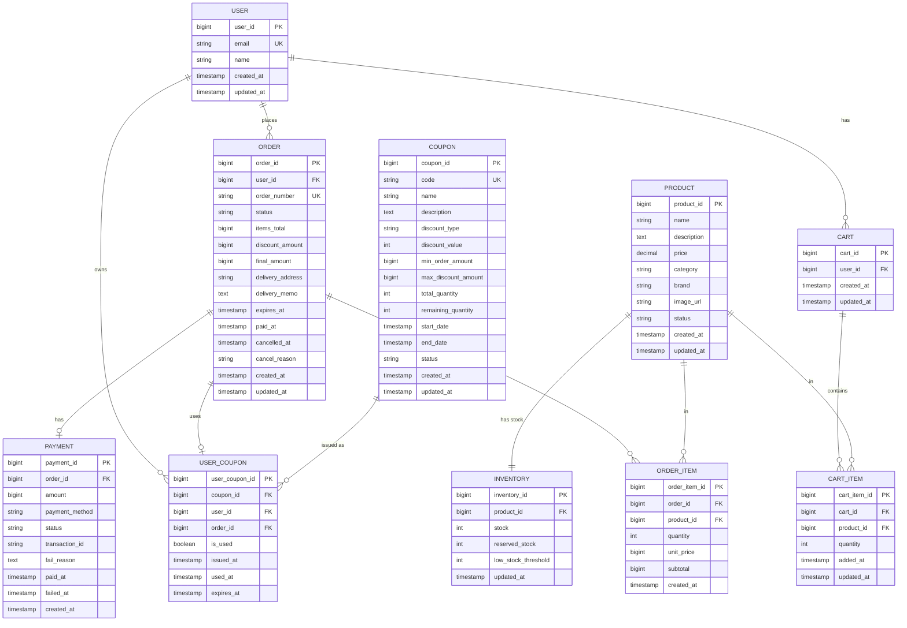

# 🗄️ Data Models - E-commerce Service

---

## 목차

1. [Entity Relationship Diagram](#entity-relationship-diagram)
2. [엔티티 상세 정의](#엔티티-상세-정의)
e
---

## Entity Relationship Diagram

### 전체 ERD



---

## 엔티티 상세 정의

### 1. User (사용자)

**테이블명**: `users`

| 컬럼명 | 타입 | NULL | 기본값 | 설명 |
|-------|------|------|-------|------|
| `user_id` | BIGINT | NO | AUTO_INCREMENT | 사용자 ID (PK) |
| `email` | VARCHAR(255) | NO | - | 이메일 (UK) |
| `name` | VARCHAR(100) | NO | - | 사용자 이름 |
| `phone` | VARCHAR(20) | YES | - | 전화번호 |
| `created_at` | TIMESTAMP | NO | CURRENT_TIMESTAMP | 생성일시 |
| `updated_at` | TIMESTAMP | NO | CURRENT_TIMESTAMP ON UPDATE | 수정일시 |

**제약조건**
- PRIMARY KEY: `user_id`
- UNIQUE KEY: `email`

---

### 2. Product (상품)

**테이블명**: `products`

| 컬럼명 | 타입 | NULL | 기본값 | 설명 |
|-------|------|------|-------|------|
| `product_id` | BIGINT | NO | AUTO_INCREMENT | 상품 ID (PK) |
| `name` | VARCHAR(255) | NO | - | 상품명 |
| `description` | TEXT | YES | - | 상품 설명 |
| `price` | DECIMAL(12,0) | NO | - | 가격 (원 단위) |
| `category` | VARCHAR(50) | NO | - | 카테고리 |
| `brand` | VARCHAR(100) | YES | - | 브랜드 |
| `image_url` | VARCHAR(500) | YES | - | 이미지 URL |
| `status` | VARCHAR(20) | NO | 'AVAILABLE' | 상품 상태 |
| `created_at` | TIMESTAMP | NO | CURRENT_TIMESTAMP | 생성일시 |
| `updated_at` | TIMESTAMP | NO | CURRENT_TIMESTAMP ON UPDATE | 수정일시 |

**제약조건**
- PRIMARY KEY: `product_id`

**상태 값**
- `AVAILABLE`: 판매 가능
- `OUT_OF_STOCK`: 품절

---

### 3. Cart (장바구니)

**테이블명**: `carts`

| 컬럼명 | 타입 | NULL | 기본값 | 설명 |
|-------|------|------|-------|------|
| `cart_id` | BIGINT | NO | AUTO_INCREMENT | 장바구니 ID (PK) |
| `user_id` | BIGINT | NO | - | 사용자 ID (FK) |
| `created_at` | TIMESTAMP | NO | CURRENT_TIMESTAMP | 생성일시 |
| `updated_at` | TIMESTAMP | NO | CURRENT_TIMESTAMP ON UPDATE | 수정일시 |

**제약조건**
- PRIMARY KEY: `cart_id`
- UNIQUE KEY: `user_id` (1 사용자 = 1 장바구니)

---

### 4. CartItem (장바구니 항목)

**테이블명**: `cart_items`

| 컬럼명 | 타입 | NULL | 기본값 | 설명 |
|-------|------|------|-------|------|
| `cart_item_id` | BIGINT | NO | AUTO_INCREMENT | 장바구니 항목 ID (PK) |
| `cart_id` | BIGINT | NO | - | 장바구니 ID (FK) |
| `product_id` | BIGINT | NO | - | 상품 ID (FK) |
| `quantity` | INT | NO | 1 | 수량 |
| `added_at` | TIMESTAMP | NO | CURRENT_TIMESTAMP | 추가일시 |
| `updated_at` | TIMESTAMP | NO | CURRENT_TIMESTAMP ON UPDATE | 수정일시 |

**제약조건**
- PRIMARY KEY: `cart_item_id`
- UNIQUE KEY: `(cart_id, product_id)` (장바구니 내 상품 중복 방지)

---

### 5. Order (주문)

**테이블명**: `orders`

| 컬럼명 | 타입 | NULL | 기본값 | 설명 |
|-------|------|------|-------|------|
| `order_id` | BIGINT | NO | AUTO_INCREMENT | 주문 ID (PK) |
| `user_id` | BIGINT | NO | - | 사용자 ID (FK) |
| `order_number` | VARCHAR(50) | NO | - | 주문번호 (UK) |
| `status` | VARCHAR(20) | NO | 'PENDING' | 주문 상태 |
| `items_total` | BIGINT | NO | 0 | 상품 합계 금액 |
| `discount_amount` | BIGINT | NO | 0 | 할인 금액 |
| `final_amount` | BIGINT | NO | 0 | 최종 결제 금액 |
| `delivery_address` | VARCHAR(500) | NO | - | 배송 주소 |
| `delivery_memo` | TEXT | YES | - | 배송 메모 |
| `expires_at` | TIMESTAMP | YES | - | 만료 시간 (15분) |
| `paid_at` | TIMESTAMP | YES | - | 결제 완료 시간 |
| `cancelled_at` | TIMESTAMP | YES | - | 취소 시간 |
| `cancel_reason` | VARCHAR(255) | YES | - | 취소 사유 |
| `created_at` | TIMESTAMP | NO | CURRENT_TIMESTAMP | 생성일시 |
| `updated_at` | TIMESTAMP | NO | CURRENT_TIMESTAMP ON UPDATE | 수정일시 |

**제약조건**
- PRIMARY KEY: `order_id`
- UNIQUE KEY: `order_number`

**상태 값**
- `PENDING`: 결제 대기
- `PAID`: 결제 완료
- `CONFIRMED`: 주문 확정
- `CANCELLED`: 주문 취소

**주문번호 생성 규칙**
```
형식: ORD-YYYYMMDD-{순번}
예시: ORD-20250128-001
```

---

### 6. OrderItem (주문 항목)

**테이블명**: `order_items`

| 컬럼명 | 타입 | NULL | 기본값 | 설명 |
|-------|------|------|-------|------|
| `order_item_id` | BIGINT | NO | AUTO_INCREMENT | 주문 항목 ID (PK) |
| `order_id` | BIGINT | NO | - | 주문 ID (FK) |
| `product_id` | BIGINT | NO | - | 상품 ID (FK) |
| `quantity` | INT | NO | - | 수량 |
| `unit_price` | BIGINT | NO | - | 단가 (주문 시점 가격) |
| `subtotal` | BIGINT | NO | - | 소계 |
| `created_at` | TIMESTAMP | NO | CURRENT_TIMESTAMP | 생성일시 |

**제약조건**
- PRIMARY KEY: `order_item_id`

---

### 7. Payment (결제)

**테이블명**: `payments`

| 컬럼명 | 타입 | NULL | 기본값 | 설명 |
|-------|------|------|-------|------|
| `payment_id` | BIGINT | NO | AUTO_INCREMENT | 결제 ID (PK) |
| `order_id` | BIGINT | NO | - | 주문 ID (FK) |
| `amount` | BIGINT | NO | - | 결제 금액 |
| `payment_method` | VARCHAR(20) | NO | - | 결제 수단 |
| `status` | VARCHAR(20) | NO | 'PENDING' | 결제 상태 |
| `transaction_id` | VARCHAR(100) | YES | - | PG 거래 ID |
| `fail_reason` | TEXT | YES | - | 실패 사유 |
| `paid_at` | TIMESTAMP | YES | - | 결제 완료 시간 |
| `failed_at` | TIMESTAMP | YES | - | 결제 실패 시간 |
| `created_at` | TIMESTAMP | NO | CURRENT_TIMESTAMP | 생성일시 |

**제약조건**
- PRIMARY KEY: `payment_id`

**상태 값**
- `PENDING`: 결제 대기
- `SUCCESS`: 결제 성공
- `FAILED`: 결제 실패

**결제 수단**
- `CARD`: 신용/체크카드
- `VIRTUAL_ACCOUNT`: 가상계좌
- `PHONE`: 휴대폰 결제

---

### 8. Coupon (쿠폰)

**테이블명**: `coupons`

| 컬럼명 | 타입 | NULL | 기본값 | 설명 |
|-------|------|------|-------|------|
| `coupon_id` | BIGINT | NO | AUTO_INCREMENT | 쿠폰 ID (PK) |
| `code` | VARCHAR(50) | NO | - | 쿠폰 코드 (UK) |
| `name` | VARCHAR(255) | NO | - | 쿠폰명 |
| `description` | TEXT | YES | - | 설명 |
| `discount_type` | VARCHAR(20) | NO | - | 할인 타입 |
| `discount_value` | INT | NO | - | 할인 값 |
| `min_order_amount` | BIGINT | NO | 0 | 최소 주문 금액 |
| `max_discount_amount` | BIGINT | YES | - | 최대 할인 금액 |
| `total_quantity` | INT | NO | - | 총 발급 수량 |
| `remaining_quantity` | INT | NO | - | 잔여 수량 |
| `start_date` | TIMESTAMP | NO | - | 시작일 |
| `end_date` | TIMESTAMP | NO | - | 종료일 |
| `status` | VARCHAR(20) | NO | 'ACTIVE' | 쿠폰 상태 |
| `created_at` | TIMESTAMP | NO | CURRENT_TIMESTAMP | 생성일시 |
| `updated_at` | TIMESTAMP | NO | CURRENT_TIMESTAMP ON UPDATE | 수정일시 |

**제약조건**
- PRIMARY KEY: `coupon_id`
- UNIQUE KEY: `code`

**할인 타입**
- `PERCENTAGE`: 정률 할인 (%, discount_value는 1~100)
- `FIXED_AMOUNT`: 정액 할인 (원)

**상태 값**
- `ACTIVE`: 활성
- `INACTIVE`: 비활성
- `EXPIRED`: 만료됨

---

### 9. UserCoupon (사용자 쿠폰)

**테이블명**: `user_coupons`

| 컬럼명 | 타입 | NULL | 기본값 | 설명 |
|-------|------|------|-------|------|
| `user_coupon_id` | BIGINT | NO | AUTO_INCREMENT | 사용자 쿠폰 ID (PK) |
| `coupon_id` | BIGINT | NO | - | 쿠폰 ID (FK) |
| `user_id` | BIGINT | NO | - | 사용자 ID (FK) |
| `order_id` | BIGINT | YES | - | 주문 ID (FK) |
| `is_used` | BOOLEAN | NO | FALSE | 사용 여부 |
| `issued_at` | TIMESTAMP | NO | CURRENT_TIMESTAMP | 발급일시 |
| `used_at` | TIMESTAMP | YES | - | 사용일시 |
| `expires_at` | TIMESTAMP | NO | - | 만료일시 |

**제약조건**
- PRIMARY KEY: `user_coupon_id`
- UNIQUE KEY: `(coupon_id, user_id)` (1인 1매 제한)

---

### 10. Inventory (재고)

**테이블명**: `inventory`

| 컬럼명 | 타입 | NULL | 기본값 | 설명 |
|-------|------|------|-------|------|
| `inventory_id` | BIGINT | NO | AUTO_INCREMENT | 재고 ID (PK) |
| `product_id` | BIGINT | NO | - | 상품 ID (FK, UK) |
| `stock` | INT | NO | 0 | 현재 재고 |
| `reserved_stock` | INT | NO | 0 | 예약 재고 |
| `low_stock_threshold` | INT | NO | 10 | 낮은 재고 기준 |
| `updated_at` | TIMESTAMP | NO | CURRENT_TIMESTAMP ON UPDATE | 수정일시 |

**제약조건**
- PRIMARY KEY: `inventory_id`
- UNIQUE KEY: `product_id` (1 상품 = 1 재고)

**계산 필드**
```sql
available_stock = stock - reserved_stock
```

---


## 참고 문서

- [API Specification](./api-specification.md)
- [Requirements](./requirements.md)
- [User Stories](./user-stories.md)
- [Order Flow](./order-flow.md)
