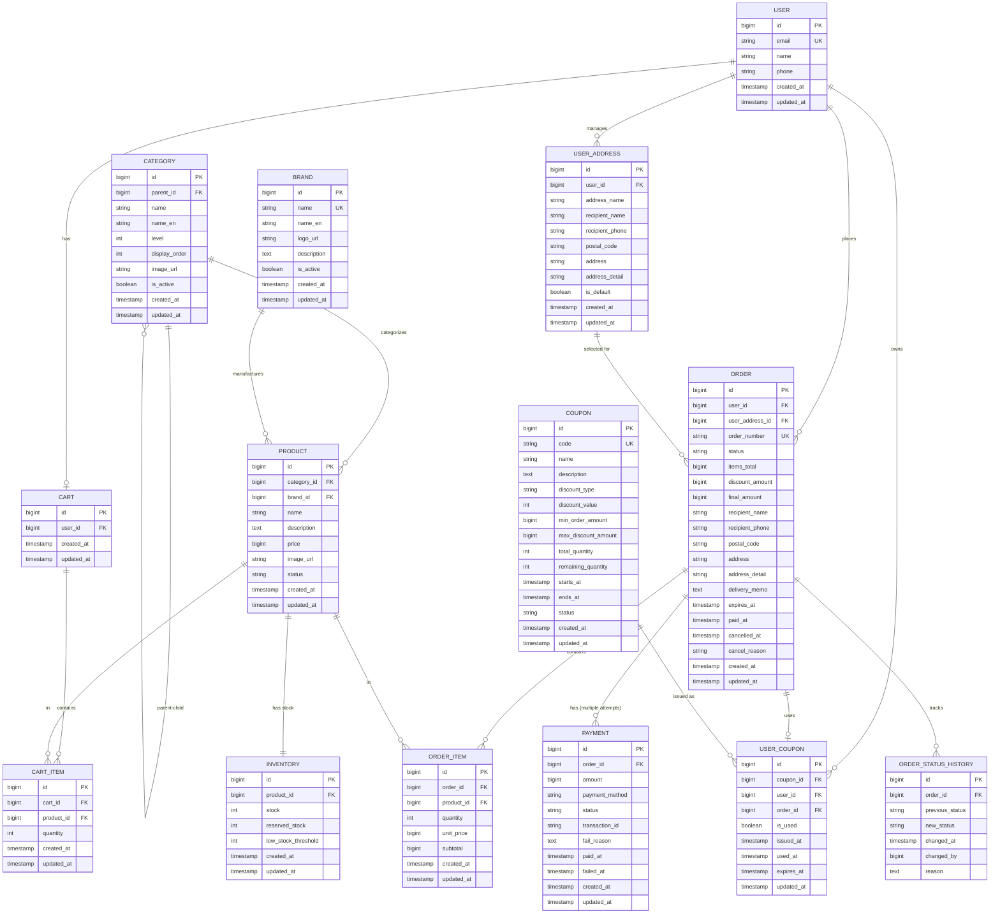

# 🗄️ Data Models - E-commerce Service

---

## 목차

1. [Entity Relationship Diagram](#entity-relationship-diagram)
2. [엔티티 상세 정의](#엔티티-상세-정의)

---

## Entity Relationship Diagram

### 전체 ERD



---

## 엔티티 상세 정의

### 1. User (사용자)

**테이블명**: `users`

| 컬럼명 | 타입 | NULL | 기본값 | 설명 |
|-------|------|------|-------|------|
| `id` | BIGINT | NO | AUTO_INCREMENT | 사용자 ID (PK) |
| `email` | VARCHAR(255) | NO | - | 이메일 (UK) |
| `name` | VARCHAR(100) | NO | - | 사용자 이름 |
| `phone` | VARCHAR(20) | YES | - | 전화번호 |
| `created_at` | TIMESTAMP | NO | CURRENT_TIMESTAMP | 생성일시 |
| `updated_at` | TIMESTAMP | NO | CURRENT_TIMESTAMP ON UPDATE | 수정일시 |

**제약조건**
- PRIMARY KEY: `id`
- UNIQUE KEY: `email`

---

### 2. UserAddress (사용자 배송지)

**테이블명**: `user_addresses`

| 컬럼명 | 타입 | NULL | 기본값 | 설명 |
|-------|------|------|-------|------|
| `id` | BIGINT | NO | AUTO_INCREMENT | 배송지 ID (PK) |
| `user_id` | BIGINT | NO | - | 사용자 ID (FK) |
| `address_name` | VARCHAR(50) | YES | - | 배송지명 (예: "집", "회사") |
| `recipient_name` | VARCHAR(100) | NO | - | 수령인 이름 |
| `recipient_phone` | VARCHAR(20) | NO | - | 수령인 전화번호 |
| `postal_code` | VARCHAR(10) | NO | - | 우편번호 |
| `address` | VARCHAR(200) | NO | - | 기본 주소 |
| `address_detail` | VARCHAR(200) | YES | - | 상세 주소 |
| `is_default` | BOOLEAN | NO | FALSE | 기본 배송지 여부 |
| `created_at` | TIMESTAMP | NO | CURRENT_TIMESTAMP | 생성일시 |
| `updated_at` | TIMESTAMP | NO | CURRENT_TIMESTAMP ON UPDATE | 수정일시 |

**제약조건**
- PRIMARY KEY: `id`
- UNIQUE KEY: `(user_id, address_name)` (사용자별 배송지명 중복 방지)

**주요 컬럼 설명**

- **`address_name` (배송지명)**
  - **목적**: 사용자가 배송지를 구분하기 위한 별칭
  - **예시**: "집", "회사", "부모님 댁" 등
  - **UNIQUE 제약**: 같은 사용자는 동일한 이름의 배송지를 중복 등록 불가

- **`is_default` (기본 배송지)**
  - **목적**: 주문 시 자동 선택되는 배송지
  - **비즈니스 규칙**: 사용자당 1개의 기본 배송지만 허용 (애플리케이션 레벨 제어)
  - **구현 방식**:
    ```java
    // 새로운 기본 배송지 설정 시 기존 기본 배송지를 일반으로 변경
    UPDATE user_addresses SET is_default = false WHERE user_id = ? AND is_default = true;
    UPDATE user_addresses SET is_default = true WHERE id = ?;
    ```

- **배송지 재사용**
  - **장점**: 자주 사용하는 배송지를 저장하여 매번 입력하지 않아도 됨
  - **UX 개선**: 원클릭 주문 시 기본 배송지 자동 선택
  - **지역별 배송비**: postal_code 기반 배송비 계산 가능

---

### 3. Category (카테고리)

**테이블명**: `categories`

| 컬럼명 | 타입 | NULL | 기본값 | 설명 |
|-------|------|------|-------|------|
| `id` | BIGINT | NO | AUTO_INCREMENT | 카테고리 ID (PK) |
| `parent_id` | BIGINT | YES | - | 상위 카테고리 ID (FK, NULL이면 최상위) |
| `name` | VARCHAR(100) | NO | - | 카테고리명 |
| `name_en` | VARCHAR(100) | YES | - | 영문 카테고리명 (다국어 지원) |
| `level` | INT | NO | - | 카테고리 레벨 (1=대분류, 2=중분류, 3=소분류) |
| `display_order` | INT | NO | 0 | 표시 순서 |
| `image_url` | VARCHAR(500) | YES | - | 카테고리 이미지 URL |
| `is_active` | BOOLEAN | NO | TRUE | 활성 여부 |
| `created_at` | TIMESTAMP | NO | CURRENT_TIMESTAMP | 생성일시 |
| `updated_at` | TIMESTAMP | NO | CURRENT_TIMESTAMP ON UPDATE | 수정일시 |

**제약조건**
- PRIMARY KEY: `id`

**주요 컬럼 설명**

- **`parent_id` (상위 카테고리)**
  - **목적**: 계층형 카테고리 구조 지원
  - **예시**:
    ```
    전자제품 (parent_id=NULL, level=1)
      └ 노트북 (parent_id=1, level=2)
          └ 게이밍 노트북 (parent_id=2, level=3)
    ```
  - **활용**: 카테고리 트리 구성, 브레드크럼 네비게이션

- **`level` (카테고리 레벨)**
  - **목적**: 카테고리 깊이 표시
  - **비즈니스 규칙**: 최대 3단계까지 허용 (애플리케이션 레벨 제어)
  - **성능**: level 기반 조회로 재귀 쿼리 방지

- **`display_order` (표시 순서)**
  - **목적**: 관리자가 지정한 순서대로 카테고리 표시
  - **예시**: 인기 카테고리를 상단에 배치

**데이터 예시**
```sql
-- 대분류
INSERT INTO categories (id, parent_id, name, level, display_order)
VALUES (1, NULL, '전자제품', 1, 1);

-- 중분류
INSERT INTO categories (id, parent_id, name, level, display_order)
VALUES (2, 1, '노트북', 2, 1);

-- 소분류
INSERT INTO categories (id, parent_id, name, level, display_order)
VALUES (3, 2, '게이밍 노트북', 3, 1);
```

---

### 4. Brand (브랜드)

**테이블명**: `brands`

| 컬럼명 | 타입 | NULL | 기본값 | 설명 |
|-------|------|------|-------|------|
| `id` | BIGINT | NO | AUTO_INCREMENT | 브랜드 ID (PK) |
| `name` | VARCHAR(100) | NO | - | 브랜드명 (UK) |
| `name_en` | VARCHAR(100) | YES | - | 영문 브랜드명 |
| `logo_url` | VARCHAR(500) | YES | - | 브랜드 로고 URL |
| `description` | TEXT | YES | - | 브랜드 설명 |
| `is_active` | BOOLEAN | NO | TRUE | 활성 여부 |
| `created_at` | TIMESTAMP | NO | CURRENT_TIMESTAMP | 생성일시 |
| `updated_at` | TIMESTAMP | NO | CURRENT_TIMESTAMP ON UPDATE | 수정일시 |

**제약조건**
- PRIMARY KEY: `id`
- UNIQUE KEY: `name`

**주요 컬럼 설명**

- **`name` UNIQUE 제약**
  - **목적**: 브랜드명 중복 방지 및 데이터 품질 향상
  - **예시**: "Apple", "APPLE", "apple" → 하나의 브랜드로 통일
  - **검색**: 브랜드명 기반 정확한 필터링 가능

- **`logo_url` (브랜드 로고)**
  - **목적**: 브랜드 페이지 구성 및 상품 목록에 표시
  - **활용**: 브랜드 아이덴티티 강화

- **브랜드 활용**
  - 브랜드별 상품 목록
  - 브랜드별 프로모션 적용
  - 브랜드 스토어 페이지 구성

---

### 5. Product (상품)

**테이블명**: `products`

| 컬럼명 | 타입 | NULL | 기본값 | 설명 |
|-------|------|------|-------|------|
| `id` | BIGINT | NO | AUTO_INCREMENT | 상품 ID (PK) |
| `category_id` | BIGINT | NO | - | 카테고리 ID (FK) |
| `brand_id` | BIGINT | YES | - | 브랜드 ID (FK) |
| `name` | VARCHAR(255) | NO | - | 상품명 |
| `description` | TEXT | YES | - | 상품 설명 |
| `price` | BIGINT | NO | - | 가격 (원 단위) |
| `image_url` | VARCHAR(500) | YES | - | 이미지 URL |
| `status` | VARCHAR(20) | NO | 'ACTIVE' | 상품 상태 |
| `created_at` | TIMESTAMP | NO | CURRENT_TIMESTAMP | 생성일시 |
| `updated_at` | TIMESTAMP | NO | CURRENT_TIMESTAMP ON UPDATE | 수정일시 |

**제약조건**
- PRIMARY KEY: `id`

**상태 값**
- `ACTIVE`: 판매 중 (활성 상품)
- `INACTIVE`: 판매 중지 (비활성)
- `DISCONTINUED`: 단종 (더 이상 판매하지 않음)

**주요 컬럼 설명**

- **`category_id` (카테고리 ID)**
  - **목적**: 상품의 카테고리 분류
  - **정규화**: Category 테이블과 연결하여 데이터 일관성 유지
  - **활용**:
    - 카테고리별 상품 목록 조회
    - 계층형 카테고리 네비게이션
    - 카테고리별 프로모션 적용
  - **예시**:
    ```sql
    -- 노트북 카테고리의 모든 상품 조회
    SELECT p.* FROM products p
    JOIN categories c ON p.category_id = c.id
    WHERE c.id = 2 OR c.parent_id = 2;
    ```

- **`brand_id` (브랜드 ID)**
  - **목적**: 상품의 브랜드 정보
  - **NULL 허용**: 브랜드가 없는 상품 (자체 제작 상품 등)
  - **정규화**: Brand 테이블과 연결하여 브랜드명 중복 방지
  - **활용**:
    - 브랜드별 상품 필터링
    - 브랜드 페이지 구성
    - 브랜드별 매출 분석

> **참고**:
> - 품절 여부는 `Inventory.available_stock` (= stock - reserved_stock)으로 판단합니다.
> - Product의 status는 상품 자체의 판매 가능 여부만 나타냅니다.
> - category와 brand를 정규화하여 데이터 품질 및 확장성을 향상시켰습니다.

---

### 6. Cart (장바구니)

**테이블명**: `carts`

| 컬럼명 | 타입 | NULL | 기본값 | 설명 |
|-------|------|------|-------|------|
| `id` | BIGINT | NO | AUTO_INCREMENT | 장바구니 ID (PK) |
| `user_id` | BIGINT | NO | - | 사용자 ID (FK) |
| `created_at` | TIMESTAMP | NO | CURRENT_TIMESTAMP | 생성일시 |
| `updated_at` | TIMESTAMP | NO | CURRENT_TIMESTAMP ON UPDATE | 수정일시 |

**제약조건**
- PRIMARY KEY: `id`
- UNIQUE KEY: `user_id` (1 사용자 = 1 장바구니)

---

### 7. CartItem (장바구니 항목)

**테이블명**: `cart_items`

| 컬럼명 | 타입 | NULL | 기본값 | 설명 |
|-------|------|------|-------|------|
| `id` | BIGINT | NO | AUTO_INCREMENT | 장바구니 항목 ID (PK) |
| `cart_id` | BIGINT | NO | - | 장바구니 ID (FK) |
| `product_id` | BIGINT | NO | - | 상품 ID (FK) |
| `quantity` | INT | NO | 1 | 수량 |
| `created_at` | TIMESTAMP | NO | CURRENT_TIMESTAMP | 생성일시 |
| `updated_at` | TIMESTAMP | NO | CURRENT_TIMESTAMP ON UPDATE | 수정일시 |

**제약조건**
- PRIMARY KEY: `id`
- UNIQUE KEY: `(cart_id, product_id)` (장바구니 내 상품 중복 방지)

**주요 컬럼 설명**

- **`UNIQUE KEY (cart_id, product_id)` (장바구니 내 상품 중복 방지)**
  - **목적**: 한 장바구니 내에서 동일 상품이 여러 행으로 중복 저장되는 것 방지
  - **실무 시나리오**:
    - 사용자가 같은 상품을 여러 번 추가하면 수량만 증가
    - 중복된 행이 아닌 단일 행의 `quantity` 업데이트
  - **구현 방식**:
    ```sql
    -- 상품 추가 시 UPSERT 패턴 사용
    INSERT INTO cart_items (cart_id, product_id, quantity)
    VALUES (1, 100, 2)
    ON DUPLICATE KEY UPDATE quantity = quantity + 2;
    ```
  - **데이터 정합성**: 동일 상품이 여러 행에 분산되어 장바구니 총액 계산 오류 방지

---

### 8. Order (주문)

**테이블명**: `orders`

| 컬럼명 | 타입 | NULL | 기본값 | 설명 |
|-------|------|------|-------|------|
| `id` | BIGINT | NO | AUTO_INCREMENT | 주문 ID (PK) |
| `user_id` | BIGINT | NO | - | 사용자 ID (FK) |
| `user_address_id` | BIGINT | YES | - | 사용자 배송지 ID (FK, 참고용) |
| `order_number` | VARCHAR(50) | NO | - | 주문번호 (UK) |
| `status` | VARCHAR(20) | NO | 'PENDING' | 주문 상태 |
| `items_total` | BIGINT | NO | 0 | 상품 합계 금액 |
| `discount_amount` | BIGINT | NO | 0 | 할인 금액 |
| `final_amount` | BIGINT | NO | 0 | 최종 결제 금액 |
| `recipient_name` | VARCHAR(100) | NO | - | 수령인 이름 (스냅샷) |
| `recipient_phone` | VARCHAR(20) | NO | - | 수령인 전화번호 (스냅샷) |
| `postal_code` | VARCHAR(10) | NO | - | 우편번호 (스냅샷) |
| `address` | VARCHAR(200) | NO | - | 기본 주소 (스냅샷) |
| `address_detail` | VARCHAR(200) | YES | - | 상세 주소 (스냅샷) |
| `delivery_memo` | TEXT | YES | - | 배송 메모 |
| `expires_at` | TIMESTAMP | YES | - | 만료 시간 (15분) |
| `paid_at` | TIMESTAMP | YES | - | 결제 완료 시간 |
| `cancelled_at` | TIMESTAMP | YES | - | 취소 시간 |
| `cancel_reason` | VARCHAR(255) | YES | - | 취소 사유 |
| `created_at` | TIMESTAMP | NO | CURRENT_TIMESTAMP | 생성일시 |
| `updated_at` | TIMESTAMP | NO | CURRENT_TIMESTAMP ON UPDATE | 수정일시 |

**제약조건**
- PRIMARY KEY: `id`
- UNIQUE KEY: `order_number`

**상태 값**
- `PENDING`: 결제 대기
- `PAID`: 결제 완료
- `CONFIRMED`: 주문 확정
- `CANCELLED`: 주문 취소

**주문번호 생성 규칙**
```
형식: ORD-YYYYMMDD-{순번}
예시: ORD-20250128-001
```

**주요 컬럼 설명**

- **`order_number` (주문번호)**
  - **목적**: 비즈니스 식별자로서 고객 대응, 인보이스, 배송 추적 등에 사용
  - **왜 PK(id)가 아닌가?**:
    - `id`는 내부 시스템용 기술적 식별자
    - `order_number`는 고객에게 노출되는 비즈니스 식별자
    - 고객 문의 시 "주문번호 ORD-20250128-001"로 소통 가능
    - 시스템 간 연동 시 안전한 외부 노출 가능 (PK 노출 지양)
  - **생성 시점**: 주문 생성 트랜잭션 내에서 원자적으로 생성
  - **중복 방지**: UNIQUE KEY 제약조건으로 중복 생성 차단

- **`expires_at` (만료 시간)**
  - **목적**: 미결제 주문의 자동 취소를 위한 만료 시점 관리
  - **실무 시나리오**:
    - 주문 생성 후 15분 내 미결제 시 재고 해제 필요
    - 배치 작업에서 `expires_at < NOW() AND status = 'PENDING'` 조건으로 취소 처리
  - **재고 관리**: 만료된 주문의 예약 재고를 다시 판매 가능 재고로 전환

- **`user_address_id` (사용자 배송지 ID)**
  - **목적**: 어느 배송지를 선택했는지 참고용으로 기록
  - **NULL 허용**: 직접 입력한 배송지의 경우 NULL
  - **주의**: 실제 배송에는 스냅샷 컬럼을 사용 (사용자가 배송지 수정해도 주문 정보는 불변)

- **배송지 스냅샷 컬럼들** (`recipient_name`, `recipient_phone`, `postal_code`, `address`, `address_detail`)
  - **목적**: 주문 시점의 배송지 정보 영구 보존
  - **왜 user_addresses를 참조하지 않는가?**:
    - 사용자가 배송지를 수정/삭제해도 주문 정보는 변경되지 않아야 함
    - 배송 완료 후에도 배송지 정보가 보존되어야 함 (CS, 재배송 등)
    - 법적/회계적으로 주문 당시 배송지 정보 유지 필요
  - **실무 시나리오**:
    - 사용자가 "집" 배송지를 서울 → 부산으로 변경
    - 과거 주문의 배송지는 여전히 "서울"로 표시 (스냅샷 유지)

- **`items_total`, `discount_amount`, `final_amount`**
  - **목적**: 금액 계산의 추적성 및 감사(Audit) 목적
  - **왜 계산값을 저장하는가?**:
    - 주문 생성 시점의 가격 정보 보존 (상품 가격 변경과 무관)
    - 정산 및 회계 감사 시 원본 데이터로 활용
    - 조회 성능 향상 (매번 계산 불필요)
  - **일관성 보장**: 애플리케이션 레벨에서 계산 후 저장, DB 레벨 검증

---

### 9. OrderStatusHistory (주문 상태 이력)

**테이블명**: `order_status_histories`

| 컬럼명 | 타입 | NULL | 기본값 | 설명 |
|-------|------|------|-------|------|
| `id` | BIGINT | NO | AUTO_INCREMENT | 이력 ID (PK) |
| `order_id` | BIGINT | NO | - | 주문 ID (FK) |
| `previous_status` | VARCHAR(20) | YES | - | 이전 상태 |
| `new_status` | VARCHAR(20) | NO | - | 새 상태 |
| `changed_at` | TIMESTAMP | NO | CURRENT_TIMESTAMP | 상태 변경 일시 |
| `changed_by` | BIGINT | YES | - | 변경자 ID (관리자 or 시스템) |
| `reason` | TEXT | YES | - | 변경 사유 |

**제약조건**
- PRIMARY KEY: `id`

**주요 컬럼 설명**

- **`previous_status` / `new_status` (이전 상태 / 새 상태)**
  - **목적**: 주문 상태 변경 이력 추적
  - **NULL 허용 (previous_status)**: 주문 생성 시 이전 상태 없음
  - **활용**:
    - 고객 문의 시 상태 변경 이력 제공
    - 배송 지연 패턴 분석
    - 이상 징후 탐지 (비정상적인 상태 전이)

- **`changed_by` (변경자)**
  - **목적**: 누가 상태를 변경했는지 기록
  - **NULL 허용**: 시스템 자동 변경의 경우 NULL
  - **값**:
    - `NULL`: 시스템 자동 처리 (결제 성공, 만료 등)
    - `관리자 ID`: 관리자가 수동으로 변경
    - `사용자 ID`: 사용자가 취소

- **`reason` (변경 사유)**
  - **목적**: 상태 변경 이유 기록
  - **예시**:
    - "결제 성공"
    - "결제 실패: 카드 한도 초과"
    - "관리자 취소: 재고 부족"
    - "사용자 요청: 단순 변심"

**활용 사례**

```sql
-- 특정 주문의 상태 변경 이력 조회
SELECT
  previous_status,
  new_status,
  changed_at,
  reason
FROM order_status_histories
WHERE order_id = 123
ORDER BY changed_at ASC;

-- 결과 예시:
-- NULL → PENDING (2025-01-28 10:00:00) "주문 생성"
-- PENDING → PAID (2025-01-28 10:05:00) "결제 성공"
-- PAID → CONFIRMED (2025-01-28 10:10:00) "주문 확정"
```

**실무 활용**
- CS 대응: 고객에게 주문 진행 상황 상세 안내
- 분석: 결제 → 배송 평균 소요 시간 계산
- 감사: 관리자 취소 이력 추적

---

### 10. OrderItem (주문 항목)

**테이블명**: `order_items`

| 컬럼명 | 타입 | NULL | 기본값 | 설명 |
|-------|------|------|-------|------|
| `id` | BIGINT | NO | AUTO_INCREMENT | 주문 항목 ID (PK) |
| `order_id` | BIGINT | NO | - | 주문 ID (FK) |
| `product_id` | BIGINT | NO | - | 상품 ID (FK) |
| `quantity` | INT | NO | - | 수량 |
| `unit_price` | BIGINT | NO | - | 단가 (주문 시점 가격) |
| `subtotal` | BIGINT | NO | - | 소계 |
| `created_at` | TIMESTAMP | NO | CURRENT_TIMESTAMP | 생성일시 |
| `updated_at` | TIMESTAMP | NO | CURRENT_TIMESTAMP ON UPDATE | 수정일시 |

**제약조건**
- PRIMARY KEY: `id`

**주요 컬럼 설명**

- **`unit_price` (단가)**
  - **목적**: 주문 시점의 상품 가격 스냅샷 저장
  - **왜 Product 테이블의 price를 참조하지 않는가?**:
    - 상품 가격은 시간에 따라 변동 가능 (할인, 프로모션 등)
    - 주문 이후 가격이 변경되어도 주문 내역은 변경되지 않아야 함
    - 법적/회계적으로 주문 당시 가격으로 거래가 성립
  - **실무 사례**:
    - 고객이 10,000원에 주문 후, 상품 가격이 15,000원으로 변경되어도 주문서에는 10,000원 유지
    - 환불/교환 시에도 구매 당시 가격 기준으로 처리

- **`subtotal` (소계)**
  - **목적**: 행 단위 금액 계산 결과 저장
  - **계산식**: `unit_price * quantity`
  - **저장 이유**: 조회 성능 최적화 및 데이터 정합성 검증 기준

---

### 11. Payment (결제)

**테이블명**: `payments`

| 컬럼명 | 타입 | NULL | 기본값 | 설명 |
|-------|------|------|-------|------|
| `id` | BIGINT | NO | AUTO_INCREMENT | 결제 ID (PK) |
| `order_id` | BIGINT | NO | - | 주문 ID (FK) |
| `amount` | BIGINT | NO | - | 결제 금액 |
| `payment_method` | VARCHAR(20) | NO | - | 결제 수단 |
| `status` | VARCHAR(20) | NO | 'PENDING' | 결제 상태 |
| `transaction_id` | VARCHAR(100) | YES | - | PG 거래 ID |
| `fail_reason` | TEXT | YES | - | 실패 사유 |
| `paid_at` | TIMESTAMP | YES | - | 결제 완료 시간 |
| `failed_at` | TIMESTAMP | YES | - | 결제 실패 시간 |
| `created_at` | TIMESTAMP | NO | CURRENT_TIMESTAMP | 생성일시 |
| `updated_at` | TIMESTAMP | NO | CURRENT_TIMESTAMP ON UPDATE | 수정일시 |

**제약조건**
- PRIMARY KEY: `id`

**상태 값**
- `PENDING`: 결제 대기
- `SUCCESS`: 결제 성공
- `FAILED`: 결제 실패

**결제 수단**
- `CARD`: 신용/체크카드
- `VIRTUAL_ACCOUNT`: 가상계좌
- `PHONE`: 휴대폰 결제

**주요 컬럼 설명**

- **`transaction_id` (PG 거래 ID)**
  - **목적**: PG사(Payment Gateway)에서 발급하는 고유 거래 식별자
  - **멱등성 보장**:
    - 네트워크 타임아웃 등으로 동일 결제 요청이 중복 발생할 수 있음
    - PG사의 `transaction_id`를 기준으로 중복 결제 여부 판단
    - 동일 `transaction_id`로 재요청 시 기존 결제 결과 반환 (중복 결제 차단)
  - **실무 시나리오**:
    ```
    1. 클라이언트가 결제 요청 → PG사 응답 대기 중 네트워크 끊김
    2. 클라이언트가 결제 실패로 판단하여 재시도
    3. PG사는 transaction_id로 중복 확인 → 첫 번째 결제 결과 반환
    4. 서버는 transaction_id 기준으로 중복 처리 차단
    ```
  - **외부 시스템 연동**:
    - PG사 관리자 페이지에서 거래 조회 시 사용
    - 정산, 환불, 취소 요청 시 필수 파라미터
  - **NULL 허용 이유**: 결제 생성(PENDING) 시점에는 미발급, PG 요청 후 할당

- **`order_id` UNIQUE 제약조건이 없는 이유**
  - 한 주문에 대해 여러 결제 시도 가능 (실패 후 재결제)
  - 결제 이력 추적을 위해 모든 시도 기록
  - 실제 완료된 결제는 `status = 'SUCCESS'` 조건으로 필터링

- **`amount` (결제 금액)**
  - **목적**: 결제 요청 시점의 금액 저장
  - **검증**: 주문의 `final_amount`와 일치 여부 검증 필수
  - **실패 케이스**: 금액 불일치 시 결제 거부 (위변조 방지)

---

### 12. Coupon (쿠폰)

**테이블명**: `coupons`

| 컬럼명 | 타입 | NULL | 기본값 | 설명 |
|-------|------|------|-------|------|
| `id` | BIGINT | NO | AUTO_INCREMENT | 쿠폰 ID (PK) |
| `code` | VARCHAR(50) | NO | - | 쿠폰 코드 (UK) |
| `name` | VARCHAR(255) | NO | - | 쿠폰명 |
| `description` | TEXT | YES | - | 설명 |
| `discount_type` | VARCHAR(20) | NO | - | 할인 타입 |
| `discount_value` | INT | NO | - | 할인 값 |
| `min_order_amount` | BIGINT | NO | 0 | 최소 주문 금액 |
| `max_discount_amount` | BIGINT | YES | - | 최대 할인 금액 |
| `total_quantity` | INT | NO | - | 총 발급 수량 |
| `remaining_quantity` | INT | NO | - | 잔여 수량 |
| `starts_at` | TIMESTAMP | NO | - | 시작일시 |
| `ends_at` | TIMESTAMP | NO | - | 종료일시 |
| `status` | VARCHAR(20) | NO | 'ACTIVE' | 쿠폰 상태 |
| `created_at` | TIMESTAMP | NO | CURRENT_TIMESTAMP | 생성일시 |
| `updated_at` | TIMESTAMP | NO | CURRENT_TIMESTAMP ON UPDATE | 수정일시 |

**제약조건**
- PRIMARY KEY: `id`
- UNIQUE KEY: `code`

**할인 타입**
- `PERCENTAGE`: 정률 할인 (%, discount_value는 1~100)
- `FIXED_AMOUNT`: 정액 할인 (원)

**상태 값**
- `ACTIVE`: 활성
- `INACTIVE`: 비활성
- `EXPIRED`: 만료됨

**주요 컬럼 설명**

- **`total_quantity` / `remaining_quantity` (총 발급 수량 / 잔여 수량)**
  - **목적**: 선착순 쿠폰의 발급 한도 관리
  - **동시성 제어 필요**:
    - 여러 사용자가 동시에 쿠폰 발급 요청 시 초과 발급 방지
    - 비관적 락(Pessimistic Lock) 또는 낙관적 락(Optimistic Lock) 적용 필요
  - **실무 시나리오**:
    ```
    UPDATE coupons
    SET remaining_quantity = remaining_quantity - 1
    WHERE id = ? AND remaining_quantity > 0
    ```
    - 영향받은 행이 0이면 발급 실패 (재고 소진)

- **`max_discount_amount` (최대 할인 금액)**
  - **목적**: 정률 할인(PERCENTAGE) 시 할인 금액 상한선 설정
  - **실무 사례**:
    - "10% 할인, 최대 5,000원" → `discount_value=10`, `max_discount_amount=5000`
    - 100,000원 상품: 10% = 10,000원 → 상한선 적용 → 5,000원 할인
    - 30,000원 상품: 10% = 3,000원 → 상한선 미적용 → 3,000원 할인

---

### 13. UserCoupon (사용자 쿠폰)

**테이블명**: `user_coupons`

| 컬럼명 | 타입 | NULL | 기본값 | 설명 |
|-------|------|------|-------|------|
| `id` | BIGINT | NO | AUTO_INCREMENT | 사용자 쿠폰 ID (PK) |
| `coupon_id` | BIGINT | NO | - | 쿠폰 ID (FK) |
| `user_id` | BIGINT | NO | - | 사용자 ID (FK) |
| `order_id` | BIGINT | YES | - | 주문 ID (FK) |
| `is_used` | BOOLEAN | NO | FALSE | 사용 여부 |
| `issued_at` | TIMESTAMP | NO | CURRENT_TIMESTAMP | 발급일시 |
| `used_at` | TIMESTAMP | YES | - | 사용일시 |
| `expires_at` | TIMESTAMP | NO | - | 만료일시 |
| `updated_at` | TIMESTAMP | NO | CURRENT_TIMESTAMP ON UPDATE | 수정일시 |

**제약조건**
- PRIMARY KEY: `id`
- UNIQUE KEY: `(coupon_id, user_id)` (1인 1매 제한)

**주요 컬럼 설명**

- **`UNIQUE KEY (coupon_id, user_id)` (중복 발급 방지)**
  - **목적**: 동일 사용자가 같은 쿠폰을 중복 발급받는 것을 방지
  - **멱등성 보장**:
    - 사용자가 발급 버튼을 여러 번 클릭해도 1매만 발급
    - DB 레벨 제약조건으로 애플리케이션 로직 오류에도 방어
  - **실무 시나리오**:
    ```sql
    -- 발급 시도
    INSERT INTO user_coupons (coupon_id, user_id, expires_at)
    VALUES (1, 100, '2025-12-31 23:59:59');

    -- 중복 발급 시 UNIQUE 제약조건 위반 에러 발생
    -- 애플리케이션에서 "이미 발급받은 쿠폰입니다" 메시지 반환
    ```
  - **예외 케이스**: 사용 후 재발급 허용하려면 제약조건 수정 필요
    - `(coupon_id, user_id, is_used)` → 미사용 쿠폰만 중복 방지

- **`order_id` (주문 ID)**
  - **목적**: 쿠폰이 어느 주문에 사용되었는지 추적
  - **NULL 허용**: 미사용 쿠폰은 NULL
  - **사용 이력 관리**:
    - 주문 취소 시 쿠폰 복구 가능 여부 판단
    - 쿠폰 사용 통계 및 효과 분석

- **`expires_at` (만료일시)**
  - **목적**: 사용자별 쿠폰 사용 가능 기한 관리
  - **Coupon.ends_at과의 차이**:
    - `Coupon.starts_at / ends_at`: 쿠폰 **발급 기간** (예: 2025-01-01 ~ 2025-12-31)
    - `UserCoupon.expires_at`: 발급받은 쿠폰의 **사용 가능 기한** (예: 발급 후 30일)
  - **설정 방식**:
    - 옵션 1: 발급일 기준 N일 후 (`issued_at + 30 days`)
    - 옵션 2: 쿠폰의 `ends_at`과 동일 (쿠폰 발급 기간 종료일)
    - **권장**: 발급일 기준 N일 후 방식 (사용자별 유효기간 독립 관리)
  - **검증 조건**:
    - 쿠폰 사용 시: `expires_at > NOW() AND is_used = false`
    - 만료된 쿠폰은 사용 불가
  - **예시**:
    ```
    Coupon.starts_at = 2025-01-01, Coupon.ends_at = 2025-12-31
    사용자 A가 2025-01-15에 발급
    → UserCoupon.expires_at = 2025-02-14 (발급 후 30일)

    사용자 B가 2025-12-20에 발급
    → UserCoupon.expires_at = 2026-01-19 (발급 후 30일)
      또는 2025-12-31 (쿠폰 종료일과 동일)
    ```

- **`is_used` / `used_at`**
  - **목적**: 쿠폰 사용 여부 및 사용 시점 기록
  - **동시성 제어**:
    - 사용자가 동시에 여러 주문에 같은 쿠폰 적용 시도 방지
    - 낙관적 락: `UPDATE user_coupons SET is_used = true WHERE id = ? AND is_used = false`

---

### 14. Inventory (재고)

**테이블명**: `inventory`

| 컬럼명 | 타입 | NULL | 기본값 | 설명 |
|-------|------|------|-------|------|
| `id` | BIGINT | NO | AUTO_INCREMENT | 재고 ID (PK) |
| `product_id` | BIGINT | NO | - | 상품 ID (FK, UK) |
| `stock` | INT | NO | 0 | 현재 재고 |
| `reserved_stock` | INT | NO | 0 | 예약 재고 |
| `low_stock_threshold` | INT | NO | 10 | 낮은 재고 기준 |
| `created_at` | TIMESTAMP | NO | CURRENT_TIMESTAMP | 생성일시 |
| `updated_at` | TIMESTAMP | NO | CURRENT_TIMESTAMP ON UPDATE | 수정일시 |

**제약조건**
- PRIMARY KEY: `id`
- UNIQUE KEY: `product_id` (1 상품 = 1 재고)

**주요 컬럼 설명**

- **`stock` / `reserved_stock` (현재 재고 / 예약 재고)**
  - **목적**: 재고의 물리적 수량과 예약된 수량을 분리 관리
  - **왜 분리하는가?**:
    - `stock`: 실제 창고에 있는 물리적 재고 수량
    - `reserved_stock`: 주문(PENDING) 상태로 예약된 재고
    - `available_stock = stock - reserved_stock`: 실제 판매 가능한 재고
  - **실무 시나리오**:
    ```
    초기: stock=100, reserved_stock=0, available=100

    [주문 생성]
    → reserved_stock += 5
    → stock=100, reserved_stock=5, available=95

    [결제 완료]
    → stock -= 5, reserved_stock -= 5
    → stock=95, reserved_stock=0, available=95

    [주문 취소/만료]
    → reserved_stock -= 5
    → stock=100, reserved_stock=0, available=100
    ```
  - **동시성 제어 필수**:
    - 여러 사용자가 동시에 같은 상품 주문 시 초과 예약 방지
    - 비관적 락 또는 낙관적 락 적용
    ```sql
    -- 재고 예약
    UPDATE inventory
    SET reserved_stock = reserved_stock + ?
    WHERE product_id = ?
      AND (stock - reserved_stock) >= ?  -- 판매 가능 재고 확인

    -- 영향받은 행이 0이면 재고 부족
    ```

- **`low_stock_threshold` (낮은 재고 기준)**
  - **목적**: 재고 부족 알림 기준값
  - **활용**:
    - 배치 작업으로 `available_stock < low_stock_threshold` 상품 조회
    - 관리자에게 재입고 알림 전송
    - 상품 상태를 `OUT_OF_STOCK`으로 자동 변경

- **`product_id` UNIQUE 제약조건**
  - **목적**: 1 상품 = 1 재고 레코드 보장
  - **멱등성**: 재고 초기화 시 INSERT 대신 UPSERT(INSERT ON DUPLICATE KEY UPDATE) 사용 가능

---


## 참고 문서

- [API Specification](./api-specification.md)
- [Requirements](./requirements.md)
- [User Stories](./user-stories.md)
- [Order Flow](./order-flow.md)
