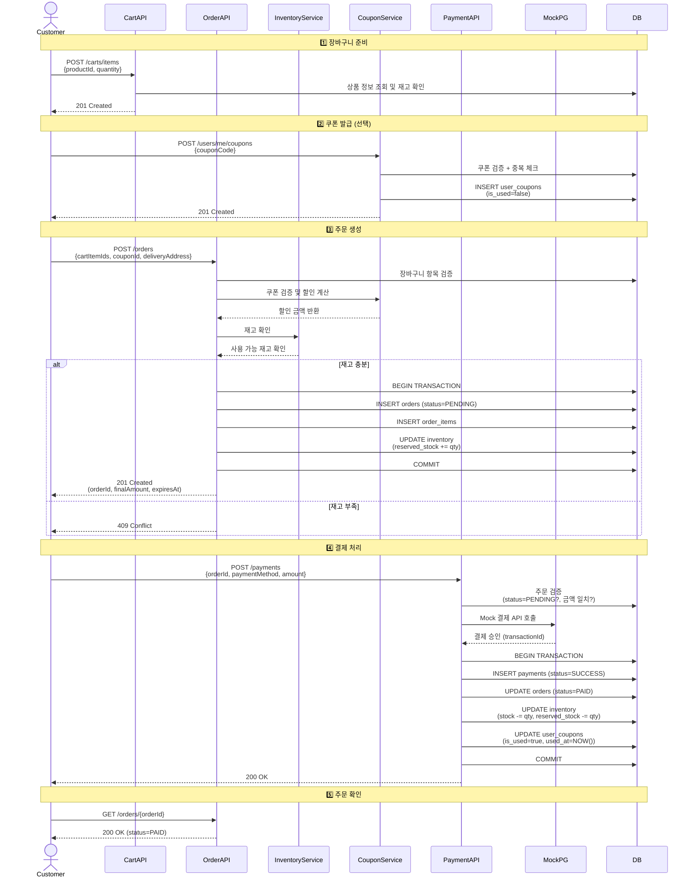
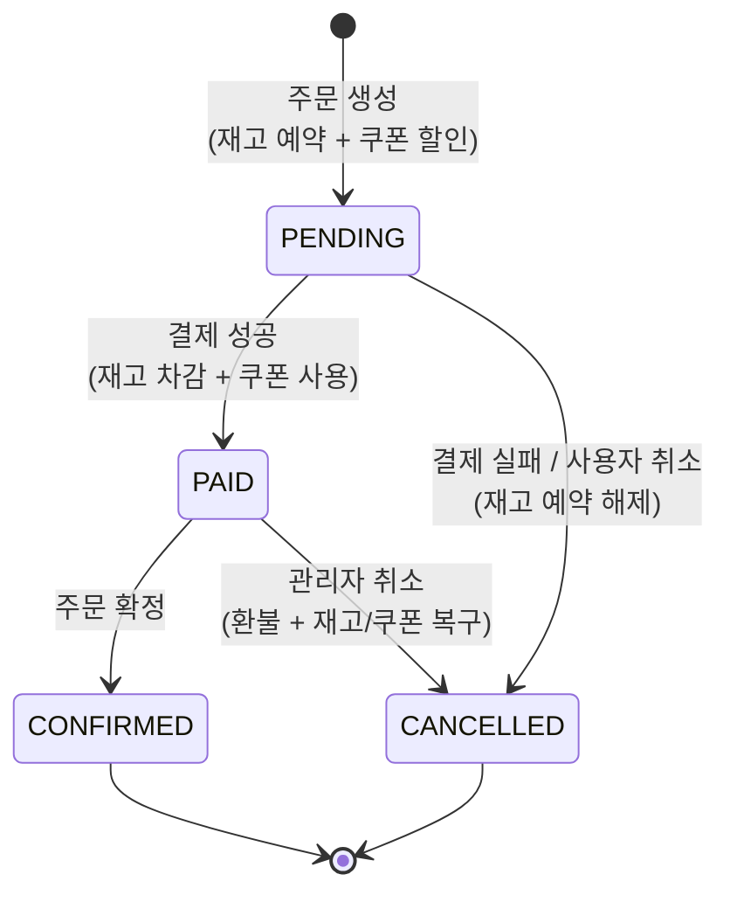
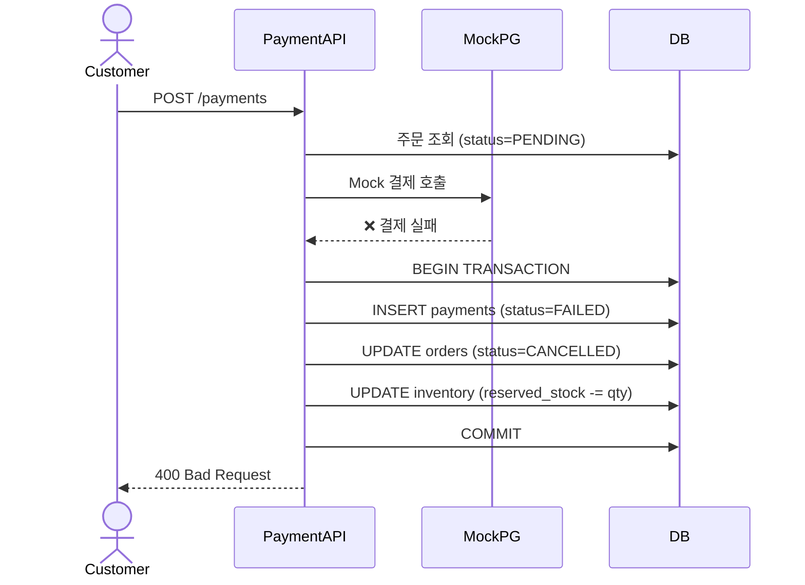

# 📦 Order Flow - 주문 및 결제 처리 흐름

> **E-commerce Core Service의 주문 생성부터 결제 완료까지의 전체 플로우**
>
> 재고 예약 시스템, Mock 결제, 쿠폰 적용, 상태 전이, 트랜잭션 관리를 포함합니다.

---

## 🚀 Quick Summary (30초 이해)

```
1. 장바구니 → 상품 담기
2. 쿠폰 발급 (선택)
3. 주문 생성 → status=PENDING + 재고 예약 (reserved_stock += qty) + 쿠폰 할인 적용
4. 결제 요청 → Mock PG 호출
   ├─ 성공: status=PAID + 재고 확정 차감 (stock -= qty) + 쿠폰 사용 처리
   └─ 실패: status=CANCELLED + 재고 예약 해제 (reserved_stock -= qty)
```

**핵심 원칙**
- ✅ 주문 생성 = 재고 예약 (다른 사용자가 구매 못하게)
- ✅ 결제 성공 = 재고 확정 차감 + 쿠폰 사용
- ✅ 결제 실패 = 재고 예약 해제 + 쿠폰 미사용 유지

---

## 목차

1. [전체 프로세스 개요](#전체-프로세스-개요)
2. [주문 상태 전이](#주문-상태-전이)
3. [시나리오별 상세 흐름](#시나리오별-상세-흐름)
4. [트랜잭션 경계](#트랜잭션-경계)
5. [실패 케이스 처리](#실패-케이스-처리)

---

## 전체 프로세스 개요

### 주문 → 결제 완료 플로우 (Happy Path)



> 💡 **핵심 포인트**
> - 주문 생성 시 재고를 **예약**하여 다른 사용자가 동시에 구매하지 못하게 함
> - 결제 성공 시 예약된 재고를 **확정 차감**하고 쿠폰을 **사용 처리**
> - 결제 실패 시 예약된 재고를 **해제**하고 쿠폰은 **미사용 상태 유지**

---

## 주문 상태 전이

### 상태 정의

| 상태 | 코드 | 설명 |
|------|------|------|
| **결제 대기** | `PENDING` | 주문 생성 완료, 재고 예약됨 |
| **결제 완료** | `PAID` | 결제 성공, 재고 확정 차감, 쿠폰 사용 완료 |
| **주문 확정** | `CONFIRMED` | 주문 최종 확정 (배송 준비) |
| **주문 취소** | `CANCELLED` | 결제 실패 또는 사용자 취소 |

### 상태 전이 다이어그램



### 상태 전이 규칙

| 현재 상태 | → 다음 상태 | 전이 조건 | 부수 효과 |
|-----------|------------|-----------|-----------|
| `PENDING` | `PAID` | 결제 성공 | 재고 확정 차감, 쿠폰 사용 |
| `PENDING` | `CANCELLED` | 결제 실패 / 사용자 취소 | 재고 예약 해제 |
| `PAID` | `CONFIRMED` | 관리자 확정 | 없음 |
| `PAID` | `CANCELLED` | 관리자 취소 | 환불, 재고/쿠폰 복구 |

---

## 시나리오별 상세 흐름

### 시나리오 1: 정상 주문 및 결제 (쿠폰 사용)

#### 1단계: 쿠폰 발급

**API:** `POST /api/v1/users/me/coupons`

**처리 과정:**
1. 쿠폰 코드로 쿠폰 조회
2. 쿠폰 유효성 검증
   - 쿠폰 상태: `ACTIVE`
   - 쿠폰 기간: `NOW() BETWEEN starts_at AND ends_at`
   - 잔여 수량: `remaining_quantity > 0`
3. 중복 발급 확인 (1인 1매)
4. **트랜잭션:**
   - `user_coupons` 생성 (is_used=false)
   - `coupons.remaining_quantity` 감소

**응답 예시:**
```json
{
  "data": {
    "userCouponId": 1,
    "code": "WELCOME2024",
    "name": "신규 회원 10% 할인",
    "discountValue": 10,
    "maxDiscountAmount": 20000,
    "isUsed": false,
    "expiresAt": "2025-12-31T23:59:59Z"
  }
}
```

---

#### 2단계: 주문 생성 (쿠폰 적용)

**API:** `POST /api/v1/orders`

**검증 항목:**
- ✅ 장바구니 항목 존재 및 소유 확인
- ✅ 상품 판매 가능 상태 (`status = 'AVAILABLE'`)
- ✅ 재고 충분 (`stock - reserved_stock >= quantity`)
- ✅ 쿠폰 유효성 (사용 시)
  - 사용자 소유, 미사용, 미만료
  - 최소 주문 금액 충족

**할인 금액 계산:**
```
상품 총액: 5,000,000원
쿠폰: 10% 할인 (최대 20,000원)

할인 금액 = MIN(5,000,000 × 0.1, 20,000) = 20,000원
최종 금액 = 5,000,000 - 20,000 = 4,980,000원
```

**트랜잭션 처리:**
1. `orders` 생성
   - status=`PENDING`
   - items_total, discount_amount, final_amount
2. `order_items` 생성
3. `inventory.reserved_stock` 증가

> ⚠️ 재고 부족 시 트랜잭션 롤백 및 409 Conflict 응답

**응답 예시:**
```json
{
  "data": {
    "orderId": 456,
    "orderNumber": "ORD-20250128-001",
    "status": "PENDING",
    "pricing": {
      "itemsTotal": 5000000,
      "discountAmount": 20000,
      "finalAmount": 4980000
    },
    "items": [...],
    "coupon": {
      "name": "신규 회원 10% 할인",
      "discountAmount": 20000
    },
    "expiresAt": "2025-01-28T10:15:00Z"
  }
}
```

---

#### 3단계: 결제 요청

**API:** `POST /api/v1/payments`

**검증 항목:**
- ✅ 주문 존재 및 소유 확인
- ✅ 주문 상태 `PENDING` (중복 결제 방지)
- ✅ 결제 금액 일치 (`amount = final_amount`)

**Mock PG 호출:**
- 80% 확률로 성공
- 실패 시: 카드 한도 초과, 잔액 부족 등

**결제 성공 트랜잭션:**
1. `payments` 생성 (status=`SUCCESS`, transaction_id)
2. `orders` 상태 변경 (status=`PAID`)
3. `inventory` 재고 확정 차감
   - `stock -= quantity`
   - `reserved_stock -= quantity`
4. `user_coupons` 사용 처리
   - `is_used = true`
   - `used_at = NOW()`
   - `order_id` 설정

**응답 예시:**
```json
{
  "data": {
    "paymentId": 789,
    "orderId": 456,
    "amount": 4980000,
    "status": "SUCCESS",
    "transactionId": "txn_abc123",
    "paidAt": "2025-01-28T10:05:00Z"
  }
}
```

---

### 시나리오 2: 결제 실패 처리



**결제 실패 트랜잭션:**
1. `payments` 실패 기록 생성 (status=`FAILED`, fail_reason)
2. `orders` 취소 (status=`CANCELLED`, cancel_reason)
3. `inventory` 예약 해제 (reserved_stock -= qty)
4. 쿠폰은 미사용 상태 유지

**응답 예시:**
```json
{
  "code": "PAYMENT_FAILED",
  "message": "결제에 실패했습니다",
  "details": {
    "failReason": "카드 한도 초과",
    "pgResponse": {
      "code": "CARD_LIMIT_EXCEEDED"
    }
  }
}
```

---

## 트랜잭션 경계

### 트랜잭션 범위 정의

| 시나리오 | 트랜잭션 범위 | 설명 |
|----------|---------------|------|
| **쿠폰 발급** | UserCoupon 생성 + Coupon 수량 감소 | 원자적 발급 처리 |
| **주문 생성** | Order + OrderItem + 재고 예약 | 원자적 주문 생성 |
| **결제 성공** | Payment + Order 상태 변경 + 재고 차감 + 쿠폰 사용 | 결제부터 완료까지 일관성 보장 |
| **결제 실패** | Payment + Order 취소 + 재고 예약 해제 | 실패 처리 원자성 보장 |

---

## 실패 케이스 처리

### 1. 재고 부족 (409 Conflict)

**발생 시점:** 주문 생성

**시나리오:**
```
현재 재고: stock=5, reserved_stock=4
사용 가능: 5 - 4 = 1개
주문 수량: 2개
→ 재고 부족
```

**응답:**
```json
{
  "code": "INSUFFICIENT_STOCK",
  "message": "재고가 부족합니다",
  "details": {
    "productId": 1,
    "requestedQuantity": 2,
    "availableStock": 1
  }
}
```

---

### 2. 중복 결제 방지 (400 Bad Request)

**시나리오:** 결제 버튼 중복 클릭

**검증:** 주문 상태가 `PENDING`이 아니면 결제 불가

**응답:**
```json
{
  "code": "ORDER_ALREADY_PAID",
  "message": "이미 결제가 완료된 주문입니다",
  "details": {
    "currentStatus": "PAID",
    "paidAt": "2025-01-28T10:02:00Z"
  }
}
```

---

### 3. 결제 금액 불일치 (400 Bad Request)

**검증:** `요청 금액 ≠ final_amount`

**응답:**
```json
{
  "code": "PAYMENT_AMOUNT_MISMATCH",
  "message": "결제 금액이 주문 금액과 일치하지 않습니다",
  "details": {
    "expectedAmount": 4980000,
    "requestedAmount": 5000000
  }
}
```

---

### 4. 쿠폰 오류 (400 Bad Request)

**검증 항목:**
- 이미 사용된 쿠폰
- 만료된 쿠폰
- 최소 주문 금액 미달

---

## 체크리스트

### ✅ 주문 생성 시
- [ ] 장바구니 항목 존재 및 소유 확인
- [ ] 상품 판매 가능 상태 확인
- [ ] 재고 충분 확인
- [ ] 쿠폰 유효성 확인 (사용 시)

### ✅ 결제 요청 시
- [ ] 주문 존재 및 소유 확인
- [ ] 주문 상태 `PENDING` 확인
- [ ] 결제 금액 일치 확인

### ✅ 결제 성공 처리 시
- [ ] Mock PG 응답 확인
- [ ] 주문 상태 동시성 체크
- [ ] 쿠폰 유효성 재확인

### ✅ 실패 처리 시
- [ ] 재고 예약 해제
- [ ] 주문 취소 처리
- [ ] 실패 사유 기록
- [ ] 쿠폰 미사용 상태 유지


---

## 관련 문서

- [API Specification](./api-specification.md) - REST API 명세
- [Data Models](./data-models.md) - 데이터베이스 스키마 및 ERD
- [User Stories](./user-stories.md) - 사용자 스토리
- [Requirements](./requirements.md) - 요구사항 명세
